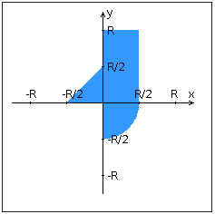

# Лабораторная работа по Веб-программированию №4

> Вариант: 3378

Переписать приложение из предыдущей лабораторной работы с использованием следующих технологий:

* Уровень back-end должен быть основан на Spring.
* Уровень front-end должен быть построен на Angular 2+ с использованием обычных полей ввода HTML
* Взаимодействие между уровнями back-end и front-end должно быть организовано посредством REST API.

Приложение по-прежнему должно включать в себя 2 страницы - стартовую и основную страницу приложения. Обе страницы приложения должны быть адаптированы для отображения в 3 режимах:

* "Десктопный" - для устройств, ширина экрана которых равна или превышает 1046 пикселей.
*  "Планшетный" - для устройств, ширина экрана которых равна или превышает 869, но меньше 1046 пикселей.
* "Мобильный"- для устройств, ширина экрана которых меньше 869 пикселей.

**Стартовая страница должна содержать следующие элементы:**

* "Шапку", содержащую ФИО студента, номер группы и номер варианта.
* Форму для ввода логина и пароля. Информация о зарегистрированных в системе пользователях должна храниться в отдельной таблице БД (пароль должен храниться в виде хэш-суммы). Доступ неавторизованных пользователей к основной странице приложения должен быть запрещён.

**Основная страница приложения должна содержать следующие элементы:**

* Набор полей ввода для задания координат точки и радиуса области в соответствии с вариантом задания: Text (-3 ... 5) для координаты по оси X, Text (-3 ... 3) для координаты по оси Y, и Text (0 ... 6) для задания радиуса области. Если поле ввода допускает ввод заведомо некорректных данных (таких, например, как буквы в координатах точки или отрицательный радиус), то приложение должно осуществлять их валидацию.
* Динамически обновляемую картинку, изображающую область на координатной плоскости в соответствии с номером варианта и точки, координаты которых были заданы пользователем. Клик по картинке должен инициировать сценарий, осуществляющий определение координат новой точки и отправку их на сервер для проверки её попадания в область. Цвет точек должен зависить от факта попадания / непопадания в область. Смена радиуса также должна инициировать перерисовку картинки.
* Таблицу со списком результатов предыдущих проверок.
* Кнопку, по которой аутентифицированный пользователь может закрыть свою сессию и вернуться на стартовую страницу приложения.

**Дополнительные требования к приложению:**

* Все результаты проверки должны сохраняться в базе данных под управлением СУБД Oracle.
* Для доступа к БД необходимо использовать Spring Data.

**Вопросы к защите лабораторной работы:**

1. Платформа Java EE. Спецификации и их реализации.
2. Принципы IoC, CDI и Location Transpanency. Компоненты и контейнеры.
3. Управление жизненным циклом компонентов. Дескрипторы развёртывания.
4. Java EE API. Виды компонентов. Профили платформы Java EE.
5. Компоненты EJB. Stateless & Stateful Session Beans. EJB Lite и EJB Full.
6. Работа с электронной почтой в Java EE. JavaMail API.
7. JMS. Реализация очередей сообщений. Способы доставки сообщений до клиента. Message-Driven Beans.
8. Понятие транзакции. Управление транзакциями в Java EE. JTA.
9. Веб-сервисы. Технологии JAX-RS и JAX-WS.
10. Платформа Spring. Сходства и отличия с Java EE.
11. Модули Spring. Архитектура Spring Runtime. Spring Security и Spring Data.
12. Реализация IoC и CDI в Spring. Сходства и отличия с Java EE.
13. Реализация REST API в Java EE и Spring.
14. React JS. Архитектура и основные принципы разработки приложений.
15. Компоненты React. State & props. "Умные" и "глупые" компоненты.
16. Разметка страниц в React-приложениях. JSX.
17. Навигация в React-приложениях. ReactRouter.
18. Управление состоянием интерфейса. Redux.
19. Angular: архитектура и основные принципы разработки приложений.
20. Angular: модули, компоненты, сервисы и DI.
21. Angular: шаблоны страниц, жизненный цикл компонентов, подключение CSS.
22. Angular: клиент-серверное взаимодействие, создание, отправка и валидация данных форм.
